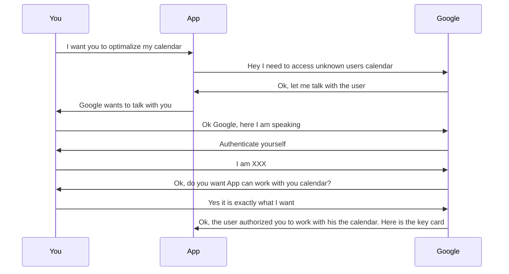
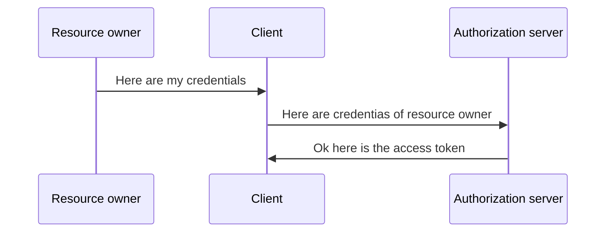
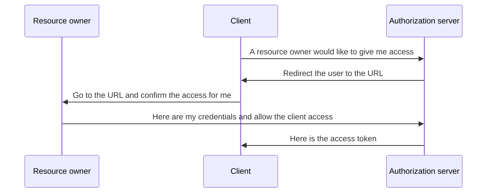
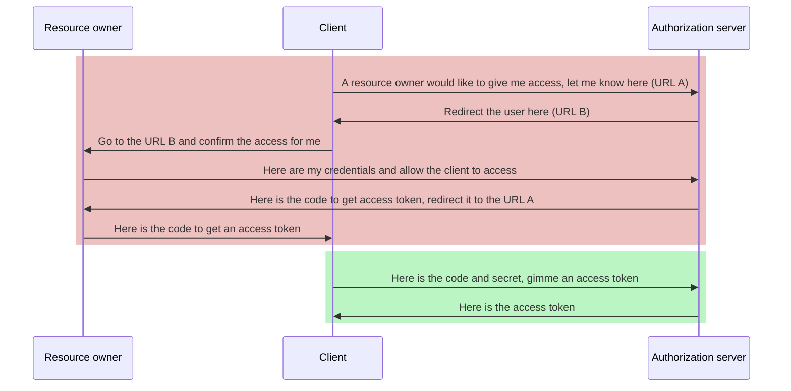
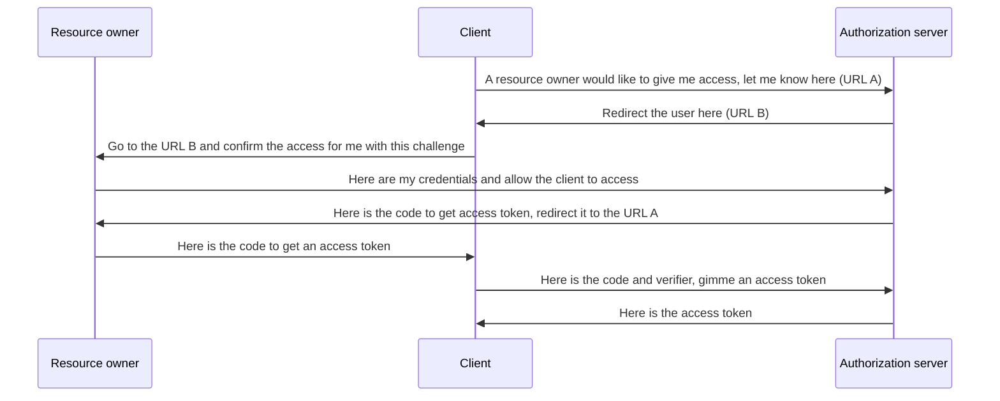
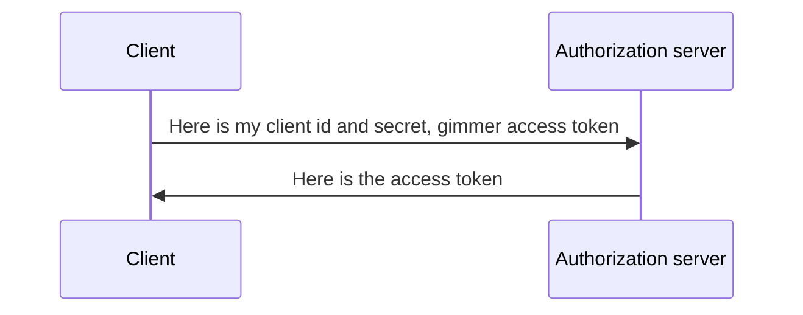

First let me state that I am not an Oauth2 nor OpenID Connect expert. I just did a lot of research about both to be sure I am using it
properly (that I am not using it improperly is more precise). That we will dive deeply into only few parts is based on the fact.   
**Purpose of the article is to provide first steps and information I find hard to get using story-like approach.**

## What is OAuth2

OAuth2 is standardized protocol for authorization (if you are lacking in the terminology see my [post]()). What is
important to say is that the scope of OAuth2 is **only** authorization. It means that OAuth2 provides ways how to authorize an entity (human, service etc.)
to another entity.

## What is OpenID Connect

OpenID Connect is top layer above OAuth2 solving the missing authentication feature. We will talk about how it is done later.

## What is OAuth2 idea

I will not be using the proper terminology (I will come back to it later) because I found OAuth2 terminology a little confusing without knowledge of OAuth2
itself. In the following diagram lets consider you have an account at Google and you are using its calendar. CO stands for an application making
optimization of you lifetime.

You can see App do not know who the user is. App just received the key card to work with the calendar. In pure OAuth2 implementation App do not receive any
information about the user (no identity), just some keys to access non-contextual calendar. You can imagine the key card as a medium. The key card is
impossible to reprogram, so the holder of the card is able to do only permitted thing with permitted resources.

### Let's add the proper terminology

In the context of the previous example:

* You = Resource owner (resource is the calendar)
* App = Client (Here we are talking about the application from OAuth2 point of view so App is OAuth2s client)
* Google = (Google stands for two parts here. It is able to identify user, and it holds calendar data)
    * Authorization server (The part that authorizes App to do things)
    * Resource server (The part where data of calendar are stored)
* The key card is implemented as a something called *token*

## How OAuth2 works

We have an idea how OAuth2 do things. Now let's dive more deep to understand how it is working. First thing to examine is gaining a permission meaning
token. Then we will make clear other aspects to reach the "aha moment".

### Types of clients
If we talk about clients here, we mean OAuth2 clients. There are two types of clients in OAuth2:
* Public
* Confidential

In OAuth2 even client has to authenticate to an authorization server. Even Google must know every client that wants to use it as authority. 
For the purpose every client is identified at least with *client_id*, and some has *client_secret* too.

#### Public
If the client is of *public* type, *client_id* is whole identification. Public clients are those which are not able to protect *client_secret* from read, 
hence there is no secret for this type of clients. These types of client must gain access more difficult way as compensation to identifying by public
*client_id* (anybody can easily get the *client_id* and use it during malicious attack).Public clients are [SPAs](#spa) for example.

##### Confidential
In case of *confidential* client the *client_id* and *client_secret* pair is identification. Yes, you feel the analogy with username:password right here.
This type of client can communicate with an authorization server confidentially thanks to *client_secret*. *Client_id* and *client_secret* must be secured
and treated as username:password!
Confidential clients are server-side parts of any application (we can call the server, service, back-end etc.). 

***

### Communication
For better understanding of why OAuth2 does things like it do, we must take a look to communication between resource owner, client and authorization server.
The OAuth2 communication is based on HTTP redirects. Redirect is special HTTP status (303 or 302) that tells to browser send request to the URL given in
one of headers. Thanks to the redirect authorization server is able to *force* resource owners browser send request to clients URL (with parameters 
contains data from authorization server). If you do not understand the information completely just remember there is this explanation and come back later.

All redirecting is done at so called [*front* channel](#front-channel). Front channel is the observable part for example browser. When I am talking about
observable I mean by 3rd party library, malicious web browser addon etc. Sources flowing through the front channel, should be heavily protected or moved
to [*back* channel](#back-channel). Back channel is the part of an application which is non-observable for example server.

***

### Gaining an access

To gaining access OAuth2 defines so called *flows*. Flow differs by usage. We will discuss later when to use which flow. In this part I will change to
OAuth2 terminology because I do not want to make it messy. In the parenthesis I reference to the first diagram as a hint.  
The goal of a flow is to gain access token. Token is the *key card* from the first diagram, and it is called access because of its purpose.

There are all available flows with example of usage:

* [Code](#code)
* [Code with Proof Key for Code Exchange (PKCE)](#code-with-proof-key-for-code-exchange-pkce)
* [Implicit](#implicit)
* [Client credentials](#client-credentials)
* [Resource owner password credentials](#resource-owner-password-credentials)

I will start with the simplest (and less secure) flow and will be proceeding to the more difficult (and more secure) ones.

#### Resource owner password credentials

This flow is kinda "make obsolete application works" solution. The main idea of OAuth2 is to keep resource owners (*You* in the first diagram)
credentials safe but this flow goes against the idea. In this flow client (*App* in the first diagram) gathers the credentials, sends it to the
Authorization server (*Google* in the first diagram). The authorization server responds with access token.

As you can see the flow is very simple and credentials very unprotected. This flow should be used as margin case of backward compatibility. Ideally do not
use it at all.

#### Implicit

This flow is kinda deprecated and replaced by [PKCE](#code-with-proof-key-for-code-exchange-pkce) but you can meet so lets take a look.
Usage of the flow is for [*SPA*](#spa) where client is able to keep the gained access token more or less securely.

One important thing to know that the "go to URL" part is done by redirection (303 or 302 http status). From security point of view 
everything is done on [*front channel*](#front-channel) hence access token is not secured as much as it can be in this flow 
(see [PKCE](#code-with-proof-key-for-code-exchange-pkce) for more secured way to deal with SPA)

#### Code
This is the most common flow if the OAuth2 client is not [*SPA*](#spa) but website with backend part. Website with backend part means that backend provides
simple web UI (not [*SPA*](#spa)) but token authorized access to resource server is done from backend part hence backend is holding all access tokens 
(for example in user sessions). Now let's focus on the flow.

What can be confusing is the last tree messages. Why the heck the authorization server returns some code and making obstacles? 
Well everything is done in matter of security. A clue can be the color differentiation and [communication](#communication) chapter.
The red part is done on [*front channel*](#front-channel) and the green part is done on [*back channel*](#back-channel). With flow like as it is,
access token never touch front channel, so there is no way for leaking. What more the code by itself is useless hence an access token is returned
only when the code is combine with client secret (we talk about [here](#types-of-clients)). Because we need a client secret, client must be 
[confidential](#confidential).

#### Code with Proof Key for Code Exchange (PKCE)
First ensure you read [Code](#code) flow first. The code with PKCE flow is very similar to the code flow with one major difference. The client in 
this case is [public](#public) so we do not have a client secret. OAuth2 must secure access token differently, and the PCKE is the solution. Let's
see the flow in a diagram:

There are no color boxes because everything is done on [*front* channel](#front-channel). In the code with PKCE flow client proofs that used code
was retrieved on the clients request (that it was no stolen). It is done with code challenge and code verifier. Both values are cryptographically
secured (description how is out of scope but there are many tutorials on the web) and authorization server is checking that hashed verifier
matches the original challenge.

#### Client credentials
This flow is designed to get access token for accessing clients own resource. Whole communication is done on [*back* channel](#back-channel)
Flow is very straight:

## Other resources

Amazing resources you can check if you feel you need another angle fo view to the topic:
* [Presentation](https://www.youtube.com/watch?v=996OiexHze0) about OAuth2 and OpenID Connect by OktaDev
* Already mentioned documentation by [OktaDev](https://developer.okta.com/docs/)

## Explanation of used terms:
### Authentication 
See the [post]()
### Authorization 
See the [post]()
### Front channel 
Term describing observable (from an attacker perspective) part of application. Browser for example is front channel because cookies and 
communication can be easily hijacked byt 3rd party library for example. The non-observable part is called *back channel*
### Back channel
Term describing non-observable (from an attacker perspective) part of application. Server for example is back channel because there is much less or 
none possibility of malicious addon or 3rd part library. The observable part is called *front channel*
### SPA
It is shortage for a single page application. Single page applications is applications running in browser that communicates without reloading
the browser page.